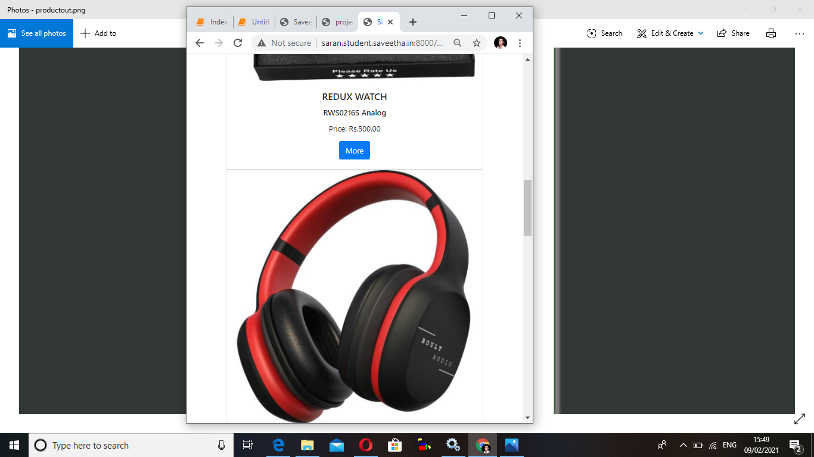

# Design of Responsive Website
## AIM:
To design a responsive website with two break points.

## DESIGN STEPS:
### Step 1: 
Requirement collection.
### Step 2:
Creating the layout using HTML and CSS.
### Step 3:
Updating the sample content.
### Step 4:
Choose the appropriate style and color scheme.
### Step 5:
Validate the layout in various browsers.
### Step 6:
Validate the HTML code.
### Step 7:
Create a database model and migrate the database.
### Step 8:
Retrieve data from database and display it in a dynamic webpage.
### Step 9:
Publish the website in the given URL.

## PROGRAM:

### responsivedesign.html
```
<!doctype html>
<html lang="en">
  <head>
    <!-- Required meta tags -->
    <meta charset="utf-8">
    <meta name="viewport" content="width=device-width, initial-scale=1, shrink-to-fit=no">

    <!-- Bootstrap CSS -->
    <link rel="stylesheet" href="https://cdn.jsdelivr.net/npm/bootstrap@4.6.0/dist/css/bootstrap.min.css" integrity="sha384-B0vP5xmATw1+K9KRQjQERJvTumQW0nPEzvF6L/Z6nronJ3oUOFUFpCjEUQouq2+l" crossorigin="anonymous">

    <title>Silicon Private Limited</title>
  </head>
  <body>
    
        <div class="jumbotron jumpotron-fluid" style="background-color:brown;">        
            <div class="container text-center" style="background-color:brown;">
            <h1 style="background-color:white;">Silicon Private Limited</h1>
            <p class="lead" style="background-color:white;">We manufacture high quality electronic products</p>
            </div>
        </div>      
        <div class="container text-center" style="background-color:whitesmoke;"">
            <div class="row">
                <div class="col-12 col-md-3 text-center">  
                   <a href="#">Home</a>     
                </div>
                <div class="col-12 col-md-3 text-center">  
                   <a href="#">Products</a>   
                </div>     
                <div class="col-12 col-md-3 text-center">  
                   <a href="#">People</a>     
                </div>   
                <div class="col-12 col-md-3 text-center">  
                   <a href="#">Contact Us</a>     
                </div>                                        
            </div>
            <div class="row">
                    <div class="col-12 lead text-center m-3">
                        Our Premium Products
                    </div>
            </div>  
            <div class="row">
                <div class="card col-12 col-md-6 col-lg-3">
                
                <div class="card-body">
                    <h5 class="card-title">DDRA4 laptop </h5>
                    <p class="card-text">Price: Rs.50000</p>
                    <a href="#" class="btn btn-primary">More</a>
                </div>
                </div>
                <div class="card col-12 col-md-6 col-lg-3">
                
                <div class="card-body">
                    <h5 class="card-title">REDUX WATCH</h5>
                    <h6 class="card-title">RWS0216S Analog</h6>
                    <p class="card-text">Price: Rs.500.00</p>
                    <a href="#" class="btn btn-primary">More</a>
                </div>
                </div>
                <div class="card col-12 col-md-6 col-lg-3">
                
                <div class="card-body">
                    <h5 class="card-title">Zebronics Zeb-Thunder</h5>
                    <h6 class="card-title">Wireless BT Headphone</h6>
                    <p class="card-text">Price: Rs.1000.00</p>
                    <a href="#" class="btn btn-primary">More</a>
                </div>
                </div>
                <div class="card col-12 col-md-6 col-lg-3">
                
                <div class="card-body">
                    <h5 class="card-title">POLESTAR</h5>
                    <h6 class="card-title">Vintage Laptop Travel Backpack</h6>
                    <p class="card-text">Price: Rs.500.00</p>
                    <a href="#" class="btn btn-primary">More</a>
                </div>
                </div>
                <div class="card col-12 col-md-6 col-lg-3">
                
                <div class="card-body">
                    <h5 class="card-title">Mi USB Type-C Cable</h5>
                    <p class="card-text">Price: Rs.200.00</p>
                    <a href="#" class="btn btn-primary">More</a>
                </div>
                </div>
                <div class="card col-12 col-md-6 col-lg-3">
                
                <div class="card-body">
                    <h5 class="card-title">Canon EOS 1500D</h5>
                    <h6 class="card-title">Digital SLR Camera(Black)</h6>
                    <p class="card-text">Price: Rs.30000.00</p>
                    <a href="#" class="btn btn-primary">More</a>
                </div>
                </div>                                

            </div>  
            <div class="row">
                    <div class="col-12">
                            Copyright © 2020 Silicon Private Limited, Developed by SARAN M.
                    </div>
            </div>                      
        </div>
              

    <!-- Optional JavaScript; choose one of the two! -->

    <!-- Option 1: jQuery and Bootstrap Bundle (includes Popper) -->
    <script src="https://code.jquery.com/jquery-3.5.1.slim.min.js" integrity="sha384-DfXdz2htPH0lsSSs5nCTpuj/zy4C+OGpamoFVy38MVBnE+IbbVYUew+OrCXaRkfj" crossorigin="anonymous"></script>
    <script src="https://cdn.jsdelivr.net/npm/bootstrap@4.6.0/dist/js/bootstrap.bundle.min.js" integrity="sha384-Piv4xVNRyMGpqkS2by6br4gNJ7DXjqk09RmUpJ8jgGtD7zP9yug3goQfGII0yAns" crossorigin="anonymous"></script>

    <!-- Option 2: Separate Popper and Bootstrap JS -->
    <!--
    <script src="https://code.jquery.com/jquery-3.5.1.slim.min.js" integrity="sha384-DfXdz2htPH0lsSSs5nCTpuj/zy4C+OGpamoFVy38MVBnE+IbbVYUew+OrCXaRkfj" crossorigin="anonymous"></script>
    <script src="https://cdn.jsdelivr.net/npm/popper.js@1.16.1/dist/umd/popper.min.js" integrity="sha384-9/reFTGAW83EW2RDu2S0VKaIzap3H66lZH81PoYlFhbGU+6BZp6G7niu735Sk7lN" crossorigin="anonymous"></script>
    <script src="https://cdn.jsdelivr.net/npm/bootstrap@4.6.0/dist/js/bootstrap.min.js" integrity="sha384-+YQ4JLhjyBLPDQt//I+STsc9iw4uQqACwlvpslubQzn4u2UU2UFM80nGisd026JF" crossorigin="anonymous"></script>
    -->
  </body>
</html>

```
## CODE VALIDATION REPORT:


## OUTPUT:





## RESULT:
Thus a website is designed for the chip manufacturing company and is hosted in the URL http://saran.student.saveetha.in:8000/responsivedesign/ HTML code is validated.